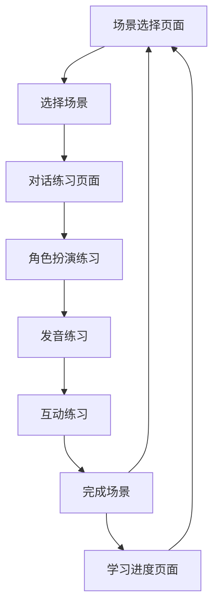

## 1. Product Overview
521词小学英语口语应用是一款专为小学生设计的英语口语学习工具，通过场景对话和互动练习提升学生的口语能力。
- 主要目的是帮助小学生在日常生活场景中学习和使用英语，解决口语练习机会少的问题
- 目标用户为6-12岁小学生，市场价值在于提供趣味性强、互动性高的英语口语学习平台

## 2. Core Features

### 2.1 User Roles
| Role | Registration Method | Core Permissions |
|------|---------------------|------------------|
| 学生 | 无需注册 | 访问所有学习功能，使用场景对话，查看学习进度 |

### 2.2 Feature Module
1. **场景选择页面**：展示多个日常生活场景，供学生选择
2. **对话练习页面**：展示场景对话内容，支持角色扮演和发音练习
3. **学习进度页面**：记录和展示学生的学习进度和完成情况

### 2.3 Page Details
| Page Name | Module Name | Feature description |
|-----------|-------------|---------------------|
| 场景选择页面 | 场景列表 | 展示多个日常生活场景（如家庭、学校、超市、医院等），每个场景配有生动的图标和简短描述 |
| 场景选择页面 | 进度指示器 | 显示每个场景的完成状态和进度 |
| 对话练习页面 | 对话展示 | 以对话形式展示场景中的英语对话，支持角色扮演切换 |
| 对话练习页面 | 发音功能 | 支持整句发音，点击对话内容可重复播放 |
| 对话练习页面 | 互动练习 | 包含对话选择、填空练习等互动元素，增强学习效果 |
| 对话练习页面 | 进度跟踪 | 记录当前对话的学习进度，标记已完成的部分 |
| 学习进度页面 | 总体进度 | 展示所有场景的学习进度和完成情况 |
| 学习进度页面 | 详细统计 | 显示学习时间、完成对话数量等详细统计信息 |

## 3. Core Process
1. 学生打开应用，进入场景选择页面
2. 从场景列表中选择一个感兴趣的场景
3. 进入对话练习页面，查看场景对话内容
4. 点击对话内容进行发音练习，切换角色扮演
5. 完成对话中的互动练习（选择、填空等）
6. 完成场景对话后，系统自动记录学习进度
7. 学生可以返回场景选择页面选择其他场景，或进入学习进度页面查看总体进度

## 4. User Interface Design
### 4.1 Design Style
- 主色调：明亮的蓝色(#4A90E2)和活泼的橙色(#FF9500)，营造轻松愉快的学习氛围
- 辅助色：柔和的绿色(#4CD964)和紫色(#9013FE)，用于强调和互动元素
- 按钮风格：圆角按钮，带有轻微的3D效果，点击时有明显的反馈动画
- 字体：使用圆润可爱的无衬线字体，如Comic Sans MS或Arial Rounded MT Bold
- 字号：标题20-24px，正文16-18px，提示文字14px
- 布局风格：卡片式布局，内容区域有柔和的阴影和圆角，整体界面简洁明了
- 图标风格：使用卡通风格的图标，色彩鲜艳，形象生动，适合儿童审美

### 4.2 Page Design Overview
| Page Name | Module Name | UI Elements |
|-----------|-------------|-------------|
| 场景选择页面 | 场景列表 | 网格布局，每个场景以卡片形式展示，包含场景图标、名称和进度条；卡片使用明亮的背景色，悬停时有轻微放大效果 |
| 场景选择页面 | 进度指示器 | 顶部显示总体学习进度条，使用渐变色填充，直观展示学习情况 |
| 对话练习页面 | 对话展示 | 气泡式对话布局，区分不同角色的对话内容；角色头像使用卡通形象，对话内容清晰易读 |
| 对话练习页面 | 发音功能 | 每个对话气泡旁有发音按钮，点击按钮时产生动画效果并播放语音 |
| 对话练习页面 | 互动练习 | 选择题使用圆形选项按钮，填空题使用带有下划线的输入框，反馈及时且带有鼓励性动画 |
| 对话练习页面 | 进度跟踪 | 页面底部显示当前场景的进度条，实时更新学习进度 |
| 学习进度页面 | 总体进度 | 环形进度图展示总体完成情况，色彩鲜明，数据可视化效果好 |
| 学习进度页面 | 详细统计 | 使用图标和数字结合的方式展示学习统计，布局整洁，信息一目了然 |

### 4.3 Responsiveness
- 设计采用移动优先原则，优先保证在手机和平板等移动设备上的良好体验
- 针对不同屏幕尺寸进行适配，确保在桌面设备上也能正确显示
- 触摸优化：按钮和互动元素尺寸适中，便于儿童触摸操作
- 横屏/竖屏适配：支持不同屏幕方向，确保内容布局合理

### 4.4 3D Scene Guidance (Not Applicable)
- 本产品为2D界面应用，不包含3D场景