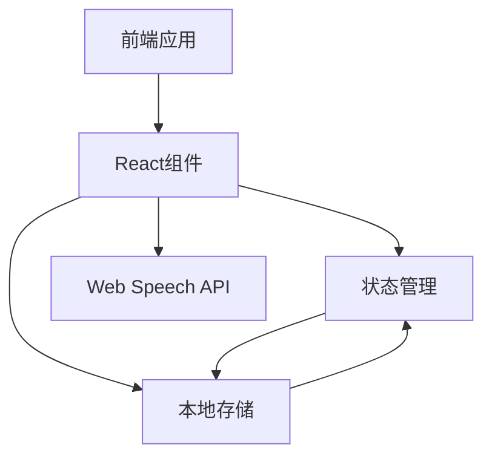
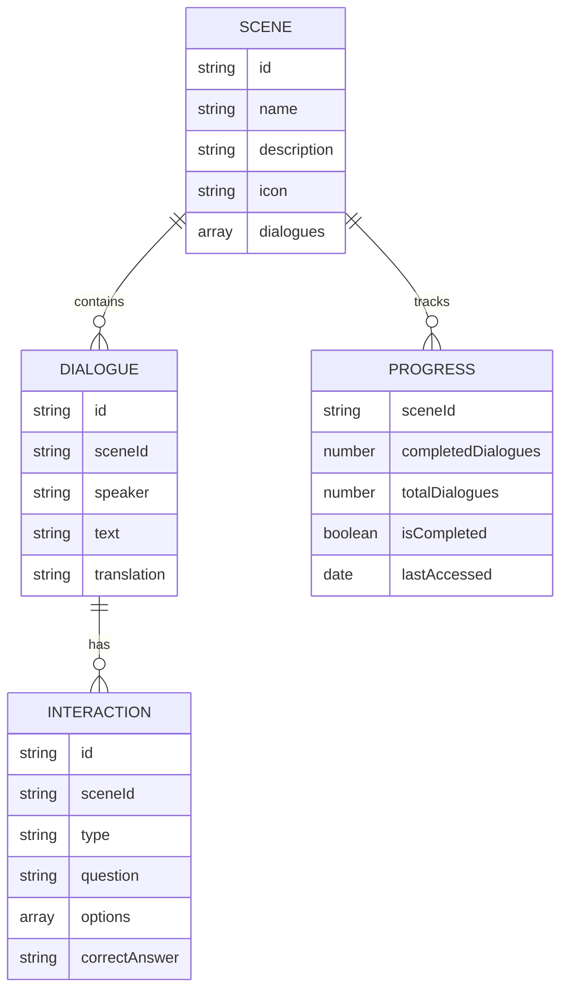

## 1. Architecture Design


## 2. Technology Description
- 前端：React@18 + tailwindcss@3 + vite
- 初始化工具：vite-init
- 后端：无（使用本地存储管理数据）
- 数据库：无（使用localStorage存储学习进度）
- 外部服务：Web Speech API（用于发音功能）

## 3. Route Definitions
| Route | Purpose |
|-------|---------|
| / | 场景选择页面 |
| /dialogue/:sceneId | 对话练习页面 |
| /progress | 学习进度页面 |

## 4. API Definitions (Not Applicable)
- 本项目为纯前端应用，不包含后端API

## 5. Server Architecture Diagram (Not Applicable)
- 本项目为纯前端应用，不包含服务器架构

## 6. Data Model
### 6.1 Data Model Definition


### 6.2 Data Definition Language (Not Applicable)
- 本项目使用本地存储，不包含数据库DDL语句

### 6.3 初始数据
- 场景数据：包含家庭、学校、超市、医院、公园等日常生活场景
- 对话数据：每个场景包含多个对话，涵盖基本的英语交流内容
- 互动练习：每个场景包含若干选择题和填空题，用于巩固学习内容

### 6.4 本地存储结构
```javascript
// localStorage存储结构
const storage = {
  // 场景进度
  sceneProgress: {
    "home": {
      completedDialogues: 3,
      totalDialogues: 5,
      isCompleted: false,
      lastAccessed: "2024-01-01T12:00:00"
    },
    // 其他场景...
  },
  
  // 总体学习统计
  learningStats: {
    totalLearningTime: 3600, // 秒
    completedScenes: 2,
    totalScenes: 5,
    lastLearned: "2024-01-01T12:00:00"
  }
};
```